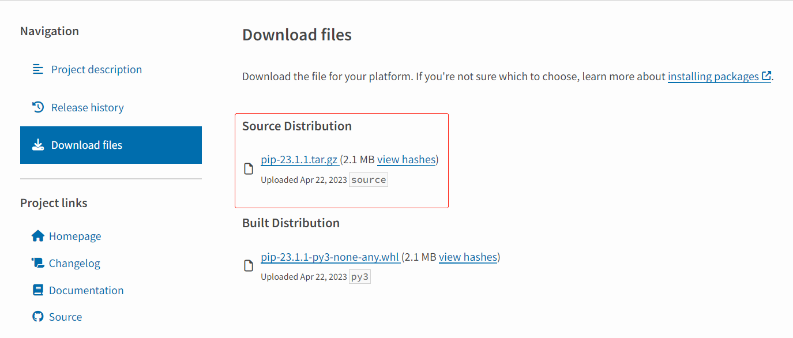

## 安装phthon

官网：<a href="https://www.python.org/downloads/windows/" target="_blank">https://www.python.org/downloads/windows/</a>

## 安装pip

pip是Python的包管理工具，该工具提供了对Python包的查找、下载、安装、卸载的功能。

官网：<a href="https://pypi.org/project/pip/#files/" target="_blank">https://pypi.org/project/pip/#files/</a>

将gz后缀文件下载并压缩



进入解压后的pip目录，执行如下命令安装

```php
python setup.py install
```

添加环境变量

H:\xxx\Python311

## 文档

### mkdocs

文档地址：<a href="https://www.mkdocs.org/" target="_blank">mkdocs</a>

### mkdocs-material

文档地址：<a href="https://squidfunk.github.io/mkdocs-material/" target="_blank">mkdocs-material</a>

使用pip安装mkdocs

```php
pip install mkdocs
```

输入以下命令开始新项目

```
mkdocs new my-project
cd my-project
```

启动服务

```php
mkdocs serve
```

## Github Pages

创建分支gh-pages

进入Actions>New workflow>set up a workflow yourself

复制如下配置

```php
name: ci 
on:
  push:
    branches:
      - master 
      - main
permissions:
  contents: write
jobs:
  deploy:
    runs-on: ubuntu-latest
    steps:
      - uses: actions/checkout@v3
      - uses: actions/setup-python@v4
        with:
          python-version: 3.x
      - uses: actions/cache@v2
        with:
          key: ${{ github.ref }}
          path: .cache
      - run: pip install mkdocs-material 
      - run: mkdocs gh-deploy --force

```

## 查看博客地址

github当前仓库>Settings>Pages
